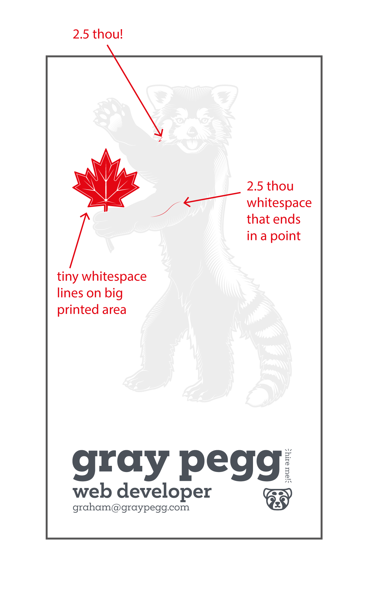

# Hi Jukebox support staff!

I've gotten some art comissioned for personal branding stuff and I've been dying to see it in print, so I'm thinking about letterpress business cards. However, I have no experience designing for letter press, so I'm a tad worried this may be too complex to make a press die for at any size. I'd prefer to not have to simplify the vector as the detail on it is the reason I wanted to see it in print, though I think digital may be the only option. A render and a list of what I think are <Jumping>probably</Jumping> issues are below.

Thanks!

2.5" x 3" Letterpress

