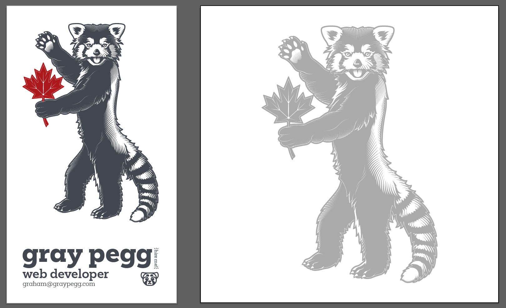

I've <Emphasis>finally</Emphasis> comitted to trying something new! I'll be using this space to try my hand at writing about web technology that I find interesting! I'm already writing up a quick rundown of how to use Web Components as a way to bridge the gap between different frameworks; something I've wanted to write since I finished up working at Xello. Stay tuned for that.

I also have an awesome new peice of art done by the amazingly talented [Quentin Peacock.](https://www.digitalheraldry.com/portfolio/) I'm so excited to finally see something that I've had as a vague idea for years, finally rendered on screen.

In addition to those new personal-branding things, I'm also starting at a [new company](https://www.landr.com/) as a Front End Engineer this week as well. Hopefully with that new job at what seems to be a very cool company will reinspire me to try writing about the web again. If I don't, feel free to pester me about it!

Be back soon with an actual blog post.