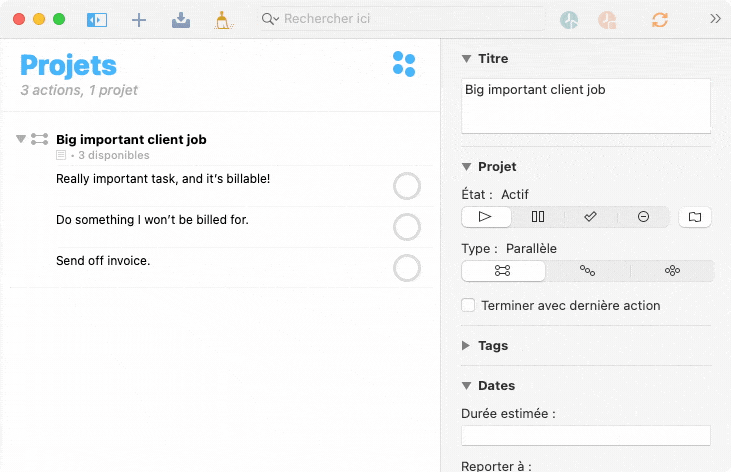
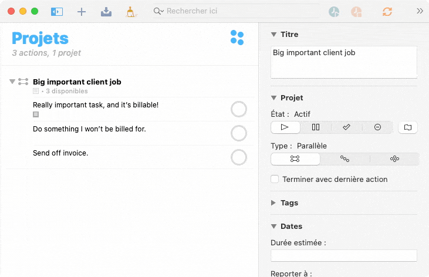
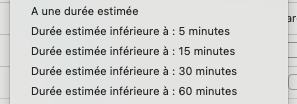
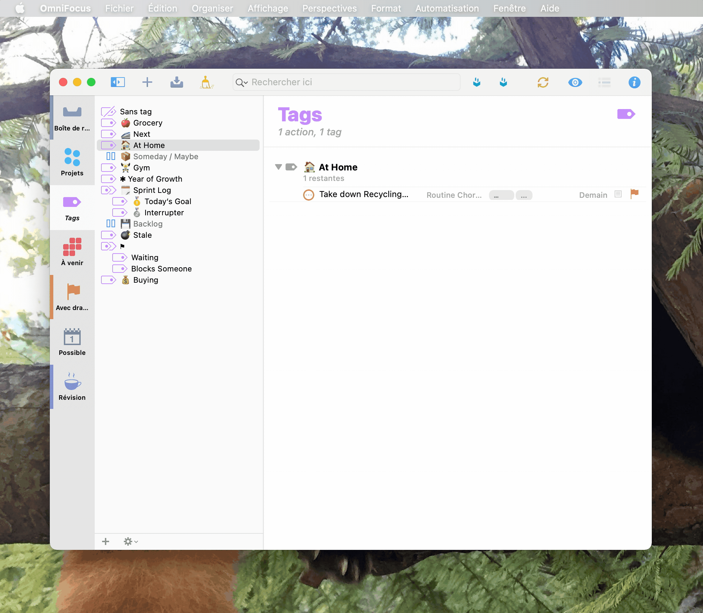

I've been using [<Annotated icon="omnifocus">omnifocus</Annotated>](https://www.omnigroup.com/omnifocus/) for a few years now, though it's only been recently that I've needed to track the time I've spent on a per-project and sometimes per-task basis. OmniFocus doesn't offer anything like that out of the box, since it really isn't meant to be a time tracker, but what it does have is a very powerful script environment which we can use to get a workflow running! However, I also need to mention <CallOut>**<Emphasis>right off the bat</Emphasis>**</CallOut> that I don't think this is a <Jumping>replacement</Jumping> for a fully-featured time tracking platform. Check out [Toggl](https://toggl.com) or something similar if you need more than just a timer. That's all this is. <Jumping>For now.</Jumping>

* [The Plugin](#the-plugin)
* [Why I did things so weird](#why-estimated-duration)
  * [Pros](#pros)
  * [Cons](#cons)
* [Installation](#installation)

### The Plugin

It's pretty easy to use! First, select the task you'd like to start timing and run the Start Timer action from either the Automation menu or by adding it to your toolbar. (You can time multiple tasks at once!) This saves a small file as an attachment to the task that records when the timer started. There is no background task running these timers, so no worries about always having OmniFocus open!

Then, once you're done working on that task for the moment, select it again and click the Stop Timer action. This will take the difference betweem the start time and now, and put that into the estimated duration field of that task. You can create perspectives using the estimated duration field, and I don't see many people using it for it's intended purpose, so I think this is a powerful spot to keep this infomation! (Benefits and caveats explained [here.](#why-estimated-duration))

#### Why Estimated Duration?
This plugin stores your tracked time in the estimated duration field. (which is evidentally **not** estimated, if it already happened.) I know this is a weird choice but hear me out. I've seen a few [OmniFocus + OmniOutliner timer scripts](https://twitter.com/toi_wah/status/954588596131921921) though they've always just recorded that information where the tools I use couldn't reach it. If it's in the note, then it's just being treated like a string. If it's in some weird part of the OmniFocus database or in an OmniOutliner document, I probably have to manually move that data around and bring it back to the actual task. That is <Emphasis>very annoying</Emphasis> to do, especially since I have trouble finding enough time to do an honest <Annotated icon="coffee">review</Annotated> perspective session. By placing the tracked time in Estimated Duration, I get:

##### Pros
* A nicely formatted time string (e.g. 34 minutes)
* It's available on every task, always.
* It's part of the app, so there's UI for it.
* No weird OmniFocus database tweaks so it's future-proof
* I can make perspectives that filter for <Rainbow>**tasks that are started**</Rainbow>, but I haven't tracked much time on them.

<Rainbow>That's the big one.</Rainbow> There are a number of Estimated Duration filters. I took a screenshot here, though sorry for the language change. You have the option (#1) of filtering for only items you've tracked **any** time on, then a range of 4 options (#2, #3, #4, #5) for filtering tasks where you've tracked **under** that amount of time.

This is useful for a lot of things.

* It gives you a "started" state for tasks and projects, as anything with time tracked can be considered to be "on going work".
* You can write up a perspective to give you a hit list of items that extended over from yesterday (tracked time, but not complete) that should be done ASAP. (This is common for me.)
* Something with under 60 minutes of work probably isn't done, but it has been worked on! I find that sometimes I set these sorts of tasks aside half-done, only to come back later and find that what I had done was good enough. Those were billable hours eh!

For these reasons alone, this is now how I do time tracking. There are however, some annoyances; most of which I think will be fixed in the future.

##### Cons
* You lose Estimated Duration's meaning. It's not an estimation anymore.
* There's no easy way to get this info out of OmniFocus programatically other than CSV or TaskPaper exports. (No easy invoicing tool imports here!)
* **Projects do not sum the estimated duration of their children.**

That last one, I'm going to open a feature request for. I think it makes sense even if I was using estimated duration as an estimate! If the parent task or project has an unset estimated duration, make it the sum of the children who do have one. This would be odd for the Omni Group team I bet, as everything else in the OmniFocus system inheirits from the parent (e.g. tags and dates) where this data is sourced from the children of a task.

**To get around this for now, I've included an action in the plugin called "Update Project's Duration" which just sums the estimated durations of the currently selected task or project's children and applies it to that node.** This is annoying, and manual, but for me, it's only ever useful when quoting for someone else, and I need the example total from an old project. Otherwise, time is normally itemized in the invoice, so the total lives there.

---

### Installation

[You can download the OmniJS bundle from here.](https://graypegg.com/stuff/OFTimer.omnifocusjs.zip) You can also grab it off of the [GitHub repo](https://github.com/graypegg/omnifocus-timer).

Download that file, then unzip it. (Safari will unzip it for you sometimes: handy!) **You should be able to just double click on it to install,** though I have had trouble with that in the past. If that is an issue, you can drop the OmniJS file into your plugins folder, which is found by going to Automation in the menu bar, then Plugins, then clicking Show In Finder.

*You should also be able to install this on iOS though I haven't tried it as of yet. If you do go down that route, I recommend installing to iCloud, so your plugin's remain synced up!*